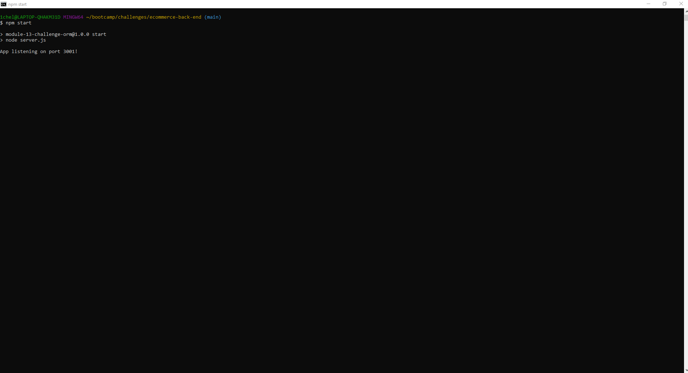
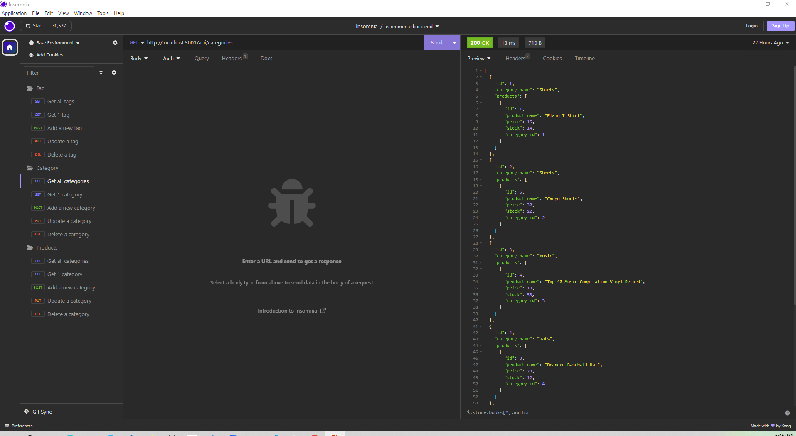

# E-Commerce Back End

# Description
    -This project involved creating an E-Commerce back end.
    -The E-Commerce Back End runs in the terminal and in Insomnia.
    -The user can view the tables, create new fields within the tables, update the tables and delete rows from the tables.
    -The options for the user to view are the Category table, the Product table, and the Tag table.
       
    
# Installation
    -In order to install this project the user must go to the terminal do an NPM i.  Then log into mysql and source the schema.js. Then exit mysql and run node seeds/index.js.  Then do an npm start to access the port.
    -From there the user will move to insomnia to run all of the get, post, put and delete.

    -Follow the following URL to the video that demonstrates installation and usage: https://drive.google.com/file/d/1yjVX9TBt8ngBEYADvh_7nsqDccf06oaG/view
    
        
    
# Usage
    

    - This screenshot is of the terminal when you are starting the program

   
    
    -   This screenshot is of Insomnia running the get routes for Categories table

# Credits
    Donnie Rawlings: https://github.com/drawlin22/
    Kyle Jocoy: https://github.com/Kylyote/
    Nedda Elsayed: https://github.com/Lven-Nemsy
    https://sequelize.org/docs/v6/core-concepts/validations-and-constraints/

      
# License
    MIT

